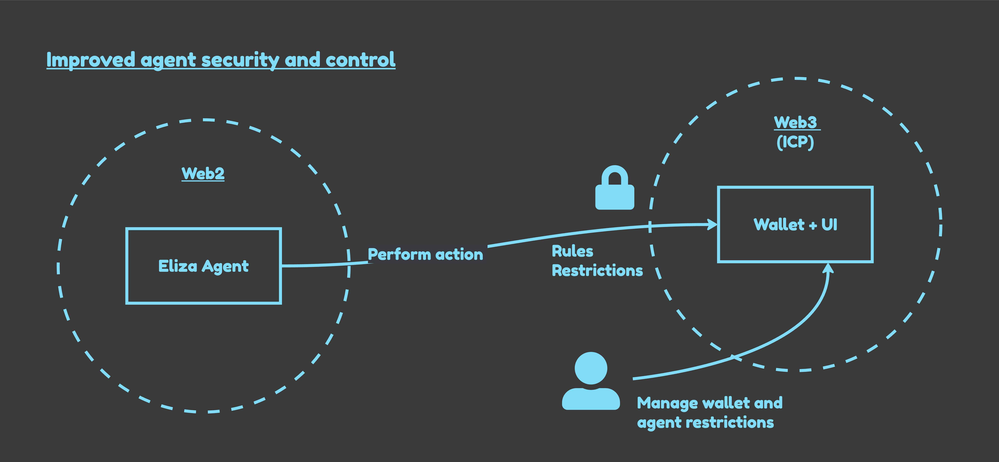

# ic-eliza-eth-wallet-plugin

## Introduction

The `ic-eliza-eth-wallet-plugin` is a demo plugin for the Eliza AI agent framework that enables a conversational AI agent to interact with an Ethereum wallet deployed on the [Internet Computer](https://internetcomputer.org/) (ICP).

There are two main drivers for this project:
1. Increase the security of AI-driven transactions 
2. Provide a way to monitor and control AI agents once deployed

Typically, an AI agent would require direct access to private keys, which is inherently unsafe. This project demonstrates a more secure pattern where an AI agent running in a Web2 environment can request transactions from a Web3 Ethereum wallet while adhering to some pre-configured security rules. The wallet enforces constraints on what the AI agent can do, reducing the risk of unauthorized access to private keys.

To monitor and control the AI agent, a separate UI is provided to manage the wallet canister. This allows users to view the wallet's balance, address, and identity, as well as set security rules for the AI agent.



## Architecture Overview

Components:
1.	ic-eliza-eth-wallet-plugin (this repository) → The Eliza plugin enabling an AI agent to interact with the wallet.
2. [ic-eliza-eth-wallet](https://github.com/kristoferlund/ic-eliza-eth-wallet) → The Ethereum wallet deployed on ICP, enforcing security rules.


## Why ICP?

ICP ([Internet Computer](https://internetcomputer.org/)) is a public blockchain where smart contracts run in a tamper-proof and decentralised environment. ICP supports threshold signatures, which allow multiple parties to jointly sign a transaction without revealing their private keys. This feature is used to secure the wallet canister, ensuring that no single party can access the wallet's private keys. Threshold signatures allow ICP to sign transactions on more than 20 different blockchains, including Ethereum.

## Features & Actions Provided

This plugin enables an AI agent to execute four actions:
* `getAddress` → Returns the Ethereum address managed by the ICP wallet.
* `getBalance` → Fetches the wallet’s ETH balance.
* `getIdentity` → Returns the Internet Computer identity the agent is using to interact with the wallet canister.
* `sendEth(to, amount)` → Requests a transfer of ETH, subject to wallet-imposed security rules.

## Security Rules

The wallet canister enforces two security rules:
1. `max_transaction_amount`: Limits the maximum amount of ETH that can be transferred in a single transaction.
2. `wait_time_minutes`: Enforces a cooldown period between transactions.

These constraints allow users to selectively grant an AI agent limited financial autonomy without exposing full control.

## Sample interaction

```bash
You: What is my ICP identity?

Agent: The Internet Computer Identity of this agent is o5x5x-rfcz6-hpwgu-p4bos-awelk-lcyjt-wajdg-2ye3l-n4c3t-n5vkk-yqe

You: send 0.0000001 eth to 0xabc...123

Agent: Successfully sent 0.0001 SepoliaETH to 0xabc...123

You: send 0.0000001 eth to 0xabc...123

Agent: Failed to send eth: Transaction too soon. Wait at least 5 minutes.
```

## Setup & Installation

### Prerequisites
* Follow the basic steps to setup an Eliza agent project, see below.
* Deploy ic-eliza-eth-wallet to ICP locally (or on mainnet), see instructions [here](https://github.com/kristoferlund/ic-eliza-eth-wallet).

### .env Configuration

Before running the agent, add the following environment variables to your `.env` file:

```bash
INTERNET_COMPUTER_PRIVATE_KEY=948e... 
IC_ETH_WALLET_CANISTER=bkyz2-...-cai 
```

The `INTERNET_COMPUTER_PRIVATE_KEY` is the private key of the Internet Computer identity that the agent will use to interact with the wallet canister. It consists of any 32-byte hex string.

You can use openssl for generating a private key by running the following commands

```bash
openssl genpkey -algorithm ed25519 -out private.pem
openssl ec -in private.pem -text -noout
```

This will yield something looking like this:

```
read EC key
ED25519 Private-Key:
priv:
   aa:bb:..
   cc:..
   dd:..
pub:
...
```

Copy all lines under priv and before pub into a text editor, remove all the colons and new lines and set the resulting string in your .env file as INTERNET_COMPUTER_PRIVATE_KEY

The `IC_ETH_WALLET_CANISTER` is the ICP canister ID of the wallet canister. When deploying the wallet canister, you will receive this ID.

## Run agent

```bash
pnpm i 
bash ./scripts/start.sh
```

---

# Eliza

## Edit the character files

Open `src/character.ts` to modify the default character. Uncomment and edit.

### Custom characters

To load custom characters instead:
- Use `pnpm start --characters="path/to/your/character.json"`
- Multiple character files can be loaded simultaneously

### Add clients
```
# in character.ts
clients: [Clients.TWITTER, Clients.DISCORD],

# in character.json
clients: ["twitter", "discord"]
```

## Duplicate the .env.example template

```bash
cp .env.example .env
```

\* Fill out the .env file with your own values.

### Add login credentials and keys to .env
```
DISCORD_APPLICATION_ID="discord-application-id"
DISCORD_API_TOKEN="discord-api-token"
...
OPENROUTER_API_KEY="sk-xx-xx-xxx"
...
TWITTER_USERNAME="username"
TWITTER_PASSWORD="password"
TWITTER_EMAIL="your@email.com"
```

## Install dependencies and start your agent

```bash
pnpm i && pnpm start
```
Note: this requires node to be at least version 22 when you install packages and run the agent.

## Run with Docker

### Build and run Docker Compose (For x86_64 architecture)

#### Edit the docker-compose.yaml file with your environment variables

```yaml
services:
    eliza:
        environment:
            - OPENROUTER_API_KEY=blahdeeblahblahblah
```

#### Run the image

```bash
docker compose up
```

### Build the image with Mac M-Series or aarch64

Make sure docker is running.

```bash
# The --load flag ensures the built image is available locally
docker buildx build --platform linux/amd64 -t eliza-starter:v1 --load .
```

#### Edit the docker-compose-image.yaml file with your environment variables

```yaml
services:
    eliza:
        environment:
            - OPENROUTER_API_KEY=blahdeeblahblahblah
```

#### Run the image

```bash
docker compose -f docker-compose-image.yaml up
```

# Deploy with Railway

[](https://railway.com/template/aW47_j)
